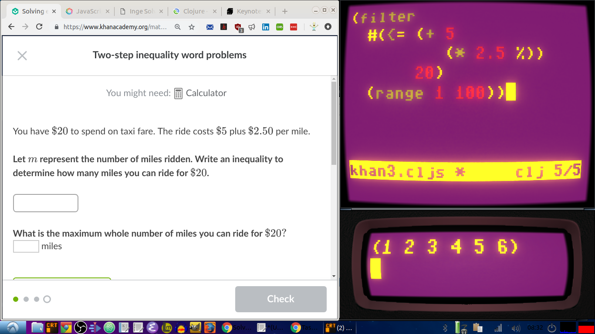

This project contains a library of Clojure functions for representing algebraic equations and performing operations on them, presented as a set of interactive web pages made using [KLIPSE](https://github.com/viebel/klipse) and [MathJax](https://www.mathjax.org/).

[Home page](https://porkostomus.github.io/algae/)

Pictured above is a screenshot of a very early stage of the project using [Bob the Clojure editor](https://github.com/porkostomus/bob) (top-right) with built-in [Planck](http://planck-repl.org/) evaluator (bottom-right). I started writing little programs to solve basic math problems, and soon realized that I may have stumbled upon something quite useful! Now I'm seeing just how far I can take it, perhaps developing it into the basis of a curriculum for teaching math using functional programming.

And if you ever need a calculator to figure out how much yeast to put in your pizza dough, I've got you covered ;)
